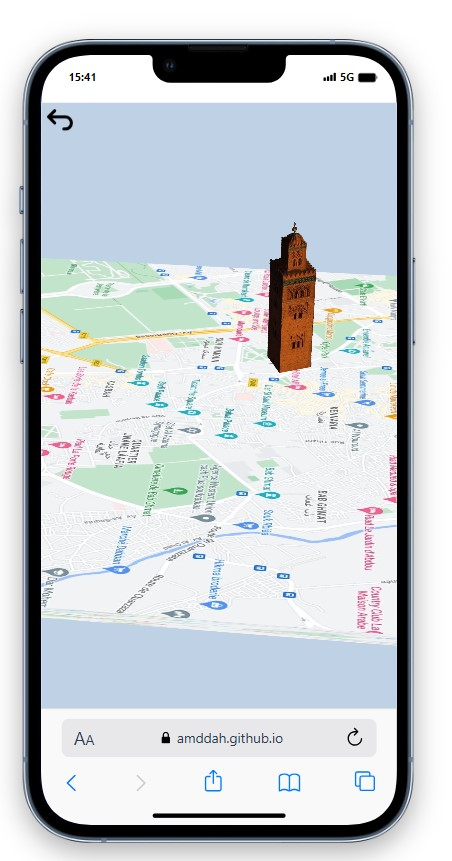

# Augmented Reality Application for Heritage Enhancement

## Overview

This application dedicated to heritage enhancement, with a specific focus on the city of Marrakech. Through simple and intuitive features, we aimed to offer users an easy immersion into the history and culture of the city

## Technologies Used

- Nodejs
- Threejs
- MindAr
- Typescript

## Screenshot

# run 

`npm install`

`npm start`

